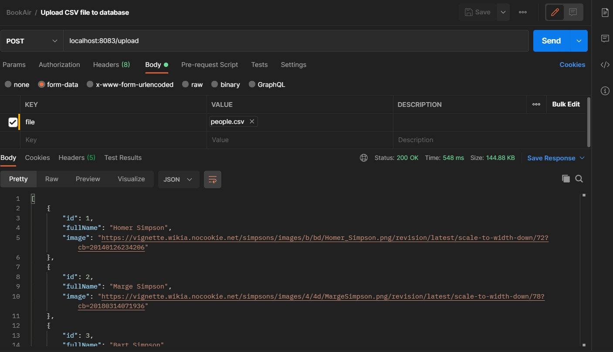
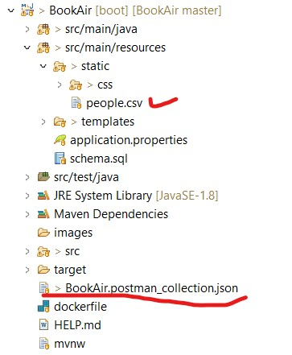
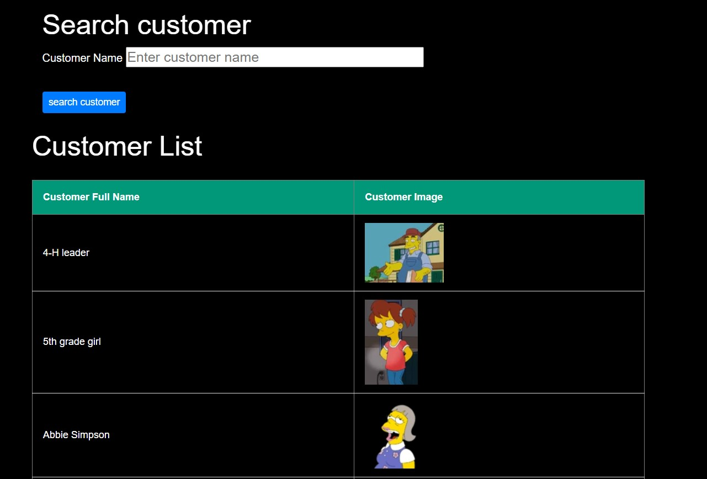
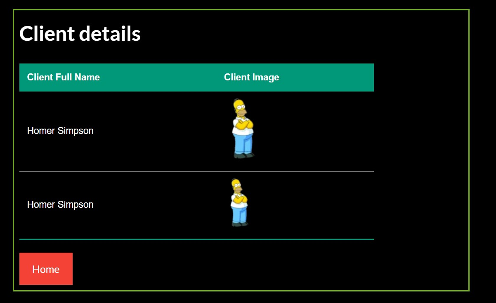
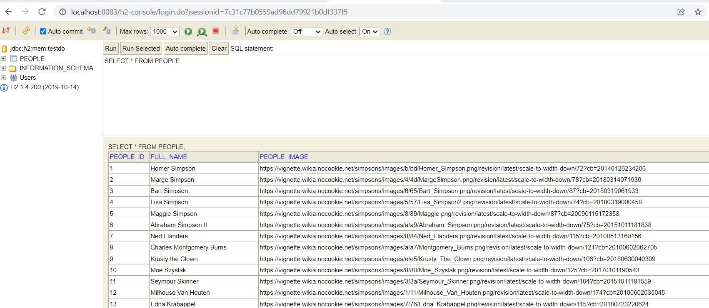

# Booking API

## How to run the application

1. start up the application.(This will start in port 8083)
2. import the postman collection and include the csv file as mentioned below .

The collection and the csv file is included in the project structure 

3. navigate to localhost:8083

**Customer search** 

**Selected Customer Screen**

**h2 inmemory database**

